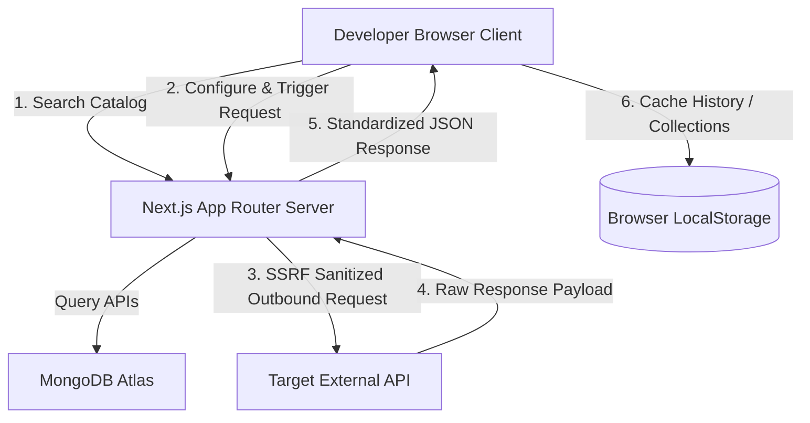
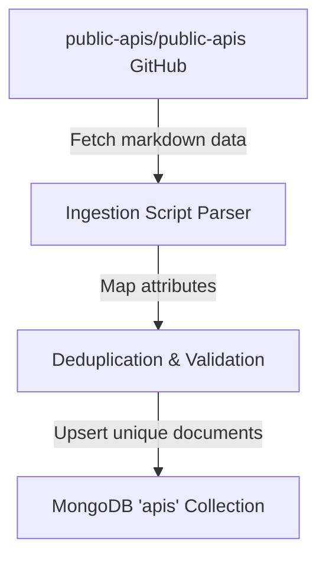

<p align="center">
  
</p>

A focused developer workspace for public API discovery, live availability checking, server-side request execution, and integration code generation.

Explore the catalog, execute requests in the Playground, inspect live HTTP responses, and organize your development APIs directly in your browser.


---

## What is Requestly?

Working with external services often forces developers to juggle documentation, Postman clients, curl requests, and custom code templates. Requestly brings these processes into one cohesive developer tool:

1. **Discover**: Browse over 1,670 normalized public APIs from a structured, searchable catalog.
2. **Verify**: Perform server-side, real-time health and latency checks on endpoints.
3. **Execute**: Build arbitrary HTTP requests (headers, query parameters, auth, body) and send them through our secure server proxy.
4. **Inspect**: Review full HTTP response status, headers, raw body, and pretty-printed JSON payloads.
5. **Code Generation**: Export verified requests immediately into cURL commands, JavaScript Fetch, or Python code.
6. **Organize**: Save APIs into custom collections and access local activity history in your workspace.

**Privacy-First Design**: Requestly requires no user accounts. Your collections, request histories, and credentials are saved locally in your browser storage (`localStorage`) and never leave your machine.

---

## Architecture

Requestly is built as a server-side proxied Next.js full-stack application backed by MongoDB Atlas.

### Runtime Request flow



### Catalog Ingestion Pipeline



---

## Features

- **API Catalog Explorer**: Filter 1,670+ APIs by category, authentication type, HTTPS requirements, and CORS capabilities.
- **Live Availability Engine**: On-demand server-side reachability validation checking real-time response latency and status codes.
- **Request Playground**: Complete editor supporting `GET`, `POST`, `PUT`, `PATCH`, and `DELETE` requests with editable headers, key-value query parameters, structured authentication (Bearer, API Key, Basic), and custom raw JSON bodies.
- **SSRF Hardened Proxy**: Built-in blocklists for private networks, loopback addresses, localhosts, and internal CIDRs to prevent Server-Side Request Forgery.
- **Workspace Collections**: Browser-local groups to save, rename, and organize APIs.
- **Credential-Scrubbed History**: A detailed workspace log to review past executions and reopen them in the playground.

---

## Tech Stack

| Layer           | Technology                                |
| --------------- | ----------------------------------------- |
| **Framework**   | Next.js 14 (App Router)                   |
| **Language**    | TypeScript                                |
| **Styling**     | Tailwind CSS v3                           |
| **Database**    | MongoDB Atlas (via native mongodb driver) |
| **Attribution** | public-apis/public-apis dataset           |

---

## Project Structure

```text
requestly/
├── app/                  # Next.js pages, API endpoints, and layouts
│   ├── api/              # Route handlers (apis, request execution, health check)
│   ├── collections/      # Saved collections workspace page
│   ├── explore/          # Repository browser catalog explorer
│   ├── history/          # Developer activity log page
│   └── playground/       # Split-pane request engine playground
├── components/           # Core presentation components
│   ├── api/              # Catalog display rows, filters, details, health indicator
│   ├── collections/      # Collections container layout
│   ├── history/          # Dense activity table rows
│   ├── landing/          # Editorial landing blocks (Hero, Overview, Capabilities)
│   └── ui/               # Reusable primitives (Buttons, Badges, Modals)
├── docs/                 # Authoritative engineering documentation
├── lib/                  # Server-side modules (request proxy, DB client, catalog queries)
├── models/               # MongoDB Document schemas
├── public/               # Static assets (approved brand images, screenshots)
├── scripts/              # Catalog database ingestion pipeline
└── types/                # Strict TypeScript interfaces
```

---

## Getting Started

### Prerequisites

- Node.js (v20 or higher recommended)
- npm or yarn
- A MongoDB database (Atlas or local instance)

### Installation

1. **Clone the repository**:

   ```bash
   git clone https://github.com/isthatpratham/requestly.git
   cd requestly
   ```

2. **Install dependencies**:

   ```bash
   npm install
   ```

3. **Configure Environment Variables**:
   Create a `.env.local` file in the root directory:

   ```env
   MONGODB_URI=mongodb+srv://<username>:<password>@cluster.mongodb.net
   MONGODB_DATABASE=requestly
   ```

4. **Initialize & Populate the Database**:
   Run the ingestion pipeline to parse the dataset and index the collection in MongoDB:

   ```bash
   npm run ingest:apis
   ```

5. **Start the Development Server**:
   ```bash
   npm run dev
   ```
   Open [http://localhost:3000](http://localhost:3000) in your browser.

---

## API Surface

All internal endpoints are server-side, read-only (except request proxy), and fully sanitized.

| Method   | Endpoint         | Purpose                                   | Query Parameters                                          |
| -------- | ---------------- | ----------------------------------------- | --------------------------------------------------------- |
| **GET**  | `/api/apis`      | Paginated search & filter of catalog APIs | `q`, `category`, `auth`, `https`, `cors`, `page`, `limit` |
| **GET**  | `/api/apis/[id]` | Fetch catalog API details by ID           | —                                                         |
| **GET**  | `/api/health`    | Live availability check for a catalog API | `apiId`, `url`                                            |
| **POST** | `/api/request`   | Proxied request execution engine          | Sends `ApiRequestState` payload                           |

---

## Security & SSRF Protection

To prevent outbound request abuse and Server-Side Request Forgery (SSRF), the execution proxy (`lib/requestEngine.ts`) implements strict validation rules:

- **Private IP Blocking**: Resolves destination hostnames and explicitly blocks loopbacks (`127.0.0.1`, `::1`), private ranges (`10.0.0.0/8`, `172.16.0.0/12`, `192.168.0.0/16`), link-local structures, and multicast networks.
- **Port Restrictions**: Restricts execution strictly to standard web ports (`80`, `443`).
- **Timeout Enforcements**: Enforces tight connect and read limits (max 5 seconds) to defend against Slowloris resource exhaustion.

---

## Documentation Links

For deeper architectural context, refer to the documents in `/docs`:

- [Product Requirements Document (PRD)](docs/PRD.md)
- [Architecture & Design Flow](docs/ARCHITECTURE.md)
- [Database & Schema Model](docs/DATABASE.md)
- [Internal API Contracts](docs/API.md)
- [Design Tokens & UI Philosophy](docs/DESIGN_SYSTEM.md)
- [Visual Redesign 2.0 Specifications](docs/FRONTEND_2.0.md)
- [Development Roadmap](docs/ROADMAP.md)

---

## API Catalog Attribution

Requestly's initial public API catalog is sourced directly from the excellent community project [public-apis/public-apis](https://github.com/public-apis/public-apis). We thank the authors, maintainers, and community contributors who maintain that index. All catalog data, endpoints, and trademarks remain the sole property of their respective authors and original owners.

---

## License

This project is licensed under the MIT License. See [LICENSE](LICENSE) for details.
